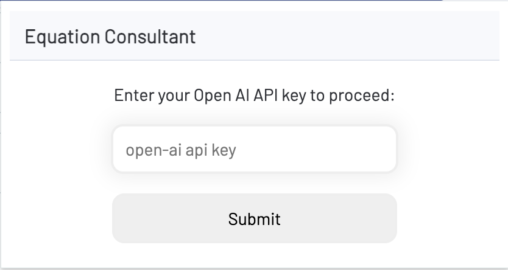
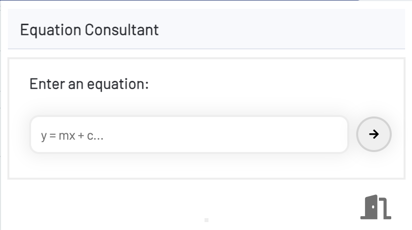

# Equation Consultant Chrome Extension MVP 1.0

## About

A chrome extension that takes a maths equation as input and then explains each element of it. The equation is explained using gpt 3.5 turbo and formatting the response with javascript. 

## How to use

Login to the extension by providing your Open AI API key:

Submit an equation. Use the exit button to return to the login page:

## How to load the extension

Naviagte to chrome://extensions/ and select load unpacked. Select the folder of the cloned repo. 